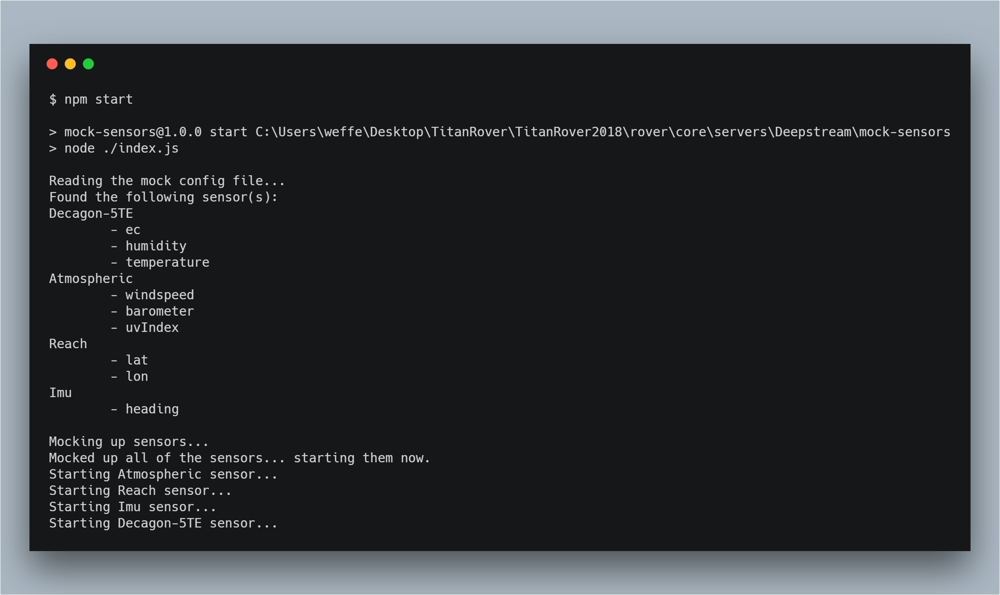

# Mock Sensors for Rover Deepstream Server

This serves as a testing platform for mocking sensors and emitting fake data to both deepstream servers: homebase and rover.

## Getting Started

The settings for where to configure the fake sensors can be found in: `mockConfig.yml`

There are two required fields that need to be inside the config file: `deepstream` and `sensors`

In order to run the process, first install the required dependencies: `npm install`

Then, start it up: `npm start

### Deepstream

You must supply the deepstream endpoints where the mock sensors will push their data to. For now, only the websocket endpoint is used.

### Sensors

You can specify as many sensors with as many keys you want to be mocked in the config file!

For each sensor there are some required and optional fields to specify.

#### Sensor Fields

- `path`: The path is __required__ and controls where the data is emitted to on deepstream. 
- `timeDelay`: The delay between every emitted data point. Default is `1000` ms.
- `debug`: Turns on printing output to the console. Default is `false`.
- `verbose`: If debug is true, this option pretty prints the entire data payload to the console. Default is `false`.
- `deepstreamServer`: Controls what deepstream server the sensor is emitting to. Can be `rover` or `homebase`. Default is `rover`
- `sensorType`: The type of mock sensor to use. Can be `default` or `cycle`. Default is `default`
- `<keyName>`: This is a key name that can be called whatever you want it to be. There can be as many keyNames as you want

#### Sensor Types

For any sensor that you add, there is an option to specify what kind of sensor it is. There is the default sensor which just randomly generates data 
in a given range. Then, there is a cycle sensor which creates every value in a given range. The cycle sensor will loop over every value and emit it to 
deepstream, constantly going up and down the range of values. If you omit the sensor type, the "default" sensor will be used.

e.g. `sensorType: default` or `sensorType: cycle`

##### Default Sensor

A default sensor has the following required fields:

- `min`: the min number the generated value will be 
- `max`: the max number the generated value will be 
- `floatingPoint`: controls if the value is generated as a floating number

##### Cycle Sensor

A cycle sensor has the following required fields: 

- `min`: the min number the generated value will be 
- `max`: the max number the generated value will be 
- `step`: the distance between two values. (e.g.  if the step is `2`, then the generated values would look like: `1..3..5`)

## Example Config

```yml
# the deepstream endpoints the mock-sensors will use to pump data into
deepstream:
    homebase:
        websocket: localhost:3020
        http: localhost:3080 # currently is not used by any mocked sensor
    rover:
        websocket: localhost:4020
        http: localhost:4080

# the sensors which will be mocked and
# how the fake data will look
sensors:
    Decagon-5TE:
        path: science/decagon # the path where the data is emitted to deepstream e.g science/decagon
        timeDelay: 1500 # [optional] [default = 1000] the amount of wait time in ms before emitting
        debug: false # [optional] [default = false] outputs generated data to the console
        verbose: false # [optional] [default = false] if debug is true, this prints out the raw data generated
        deepstreamServer: rover # [optional] [default = rover] Directs the current sensor to output it's data to a specific deepstream sensor ("homebase" or "rover")
        sensorType: default # [optional] [default = "default"] Decides what type of sensor is mocked up ("default" or "cycle")
        ec: 
            min: 0.85 # the min number the generated value will be 
            max: 1.1 # the max number the generated value will be 
            floatingPoint: true # controls if it's generated as a floating number
        humidity:
            min: 45
            max: 50
            floatingPoint: true
        temperature:
            min: 13
            max: 18.5
            floatingPoint: true
    Atmospheric:
        path: science/atmospheric
        timeDelay: 2500
        windspeed: 
            min: 3
            max: 6
            floatingPoint: false
        barometer:
            min: 28
            max: 32.25
            floatingPoint: true
        uvIndex:
            min: 0.9
            max: 1.1
            floatingPoint: true
    Reach:
        path: rover/reach
        timeDelay: 40
        sensorType: cycle
        lat:
            min: 33.872405
            max: 33.885822
            step: 0.0001
            # floatingPoint: true # this is not required for Cycle Sensors since you can control this via the step property
        lon: 
            min: -117.774862
            max: -117.858943
            step:   0.0001
    Imu: 
        path: rover/imu
        timeDelay: 40
        sensorType: cycle
        heading:
            min: 320
            max: 350
            step: 0.1
```
